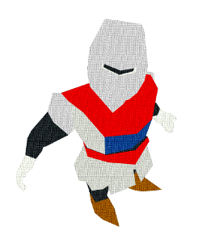
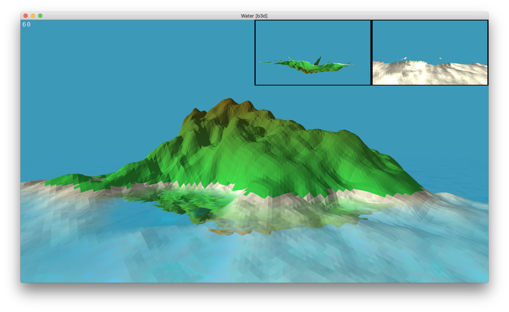
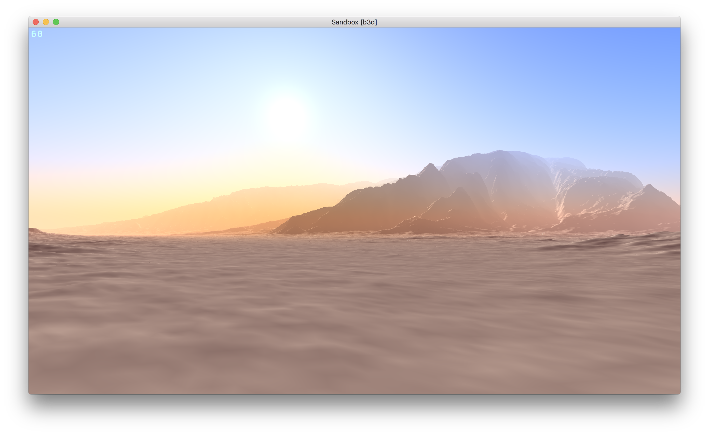
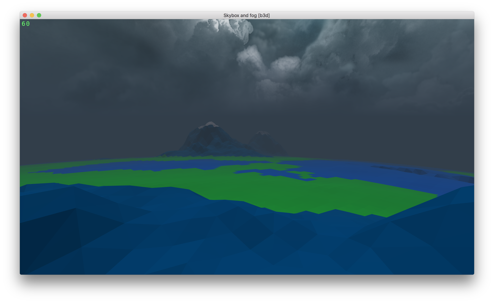
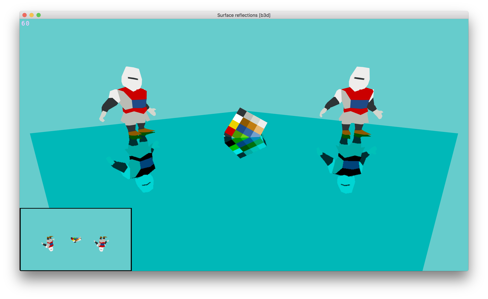
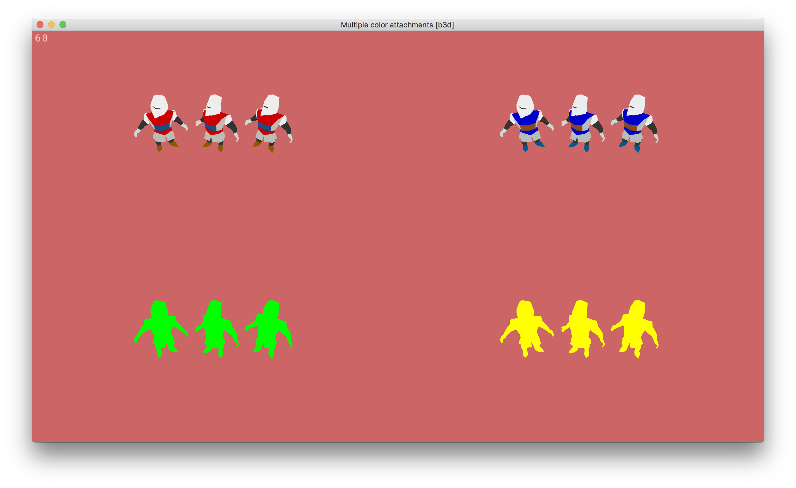
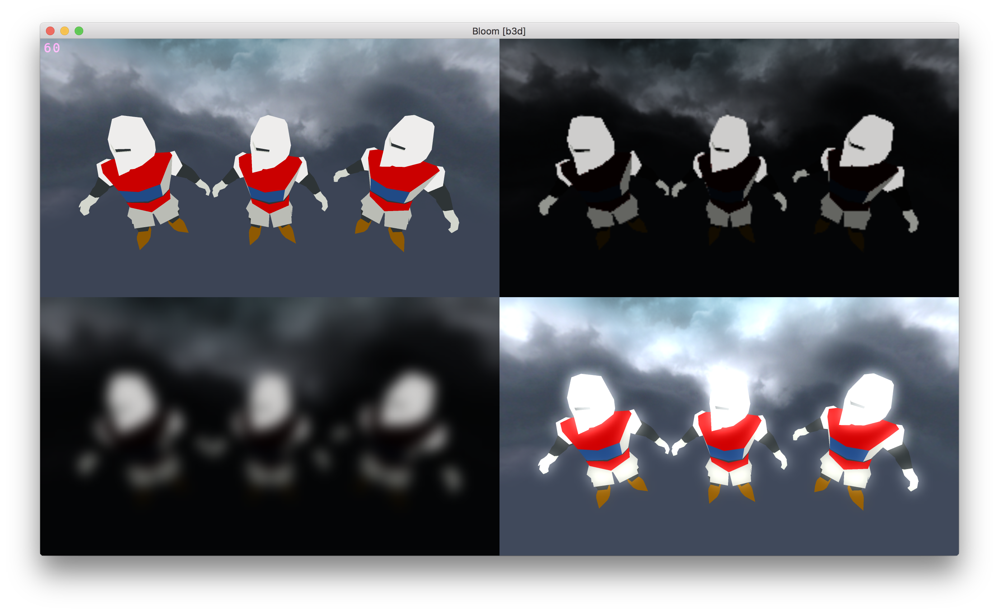
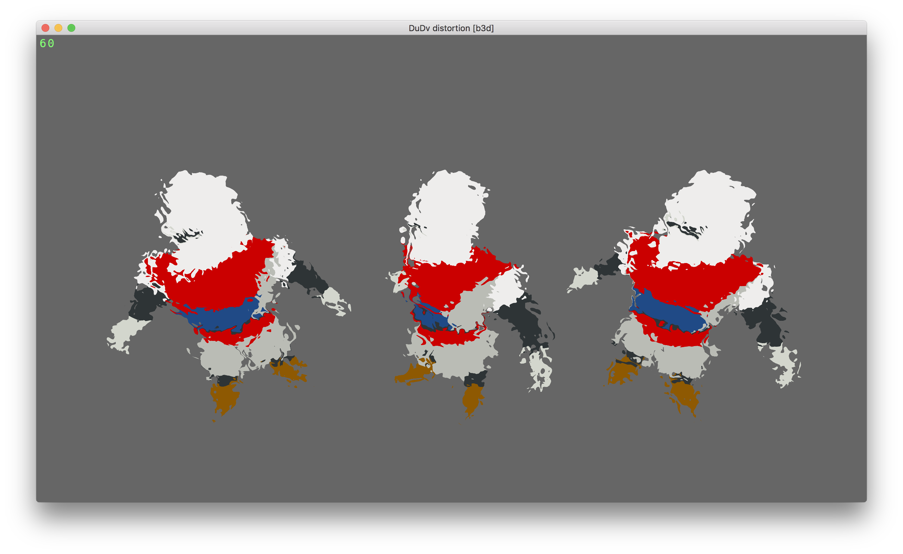
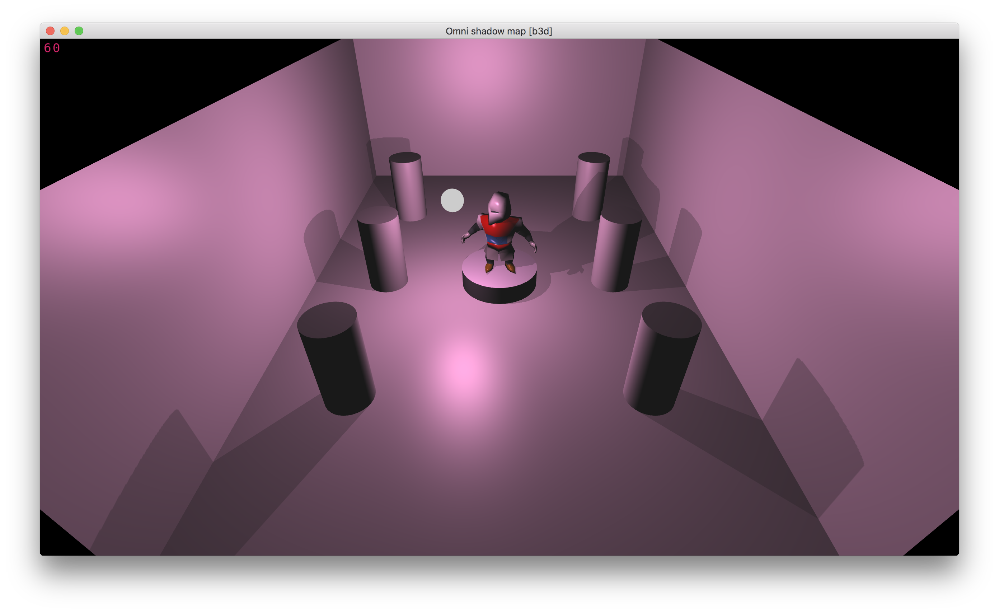
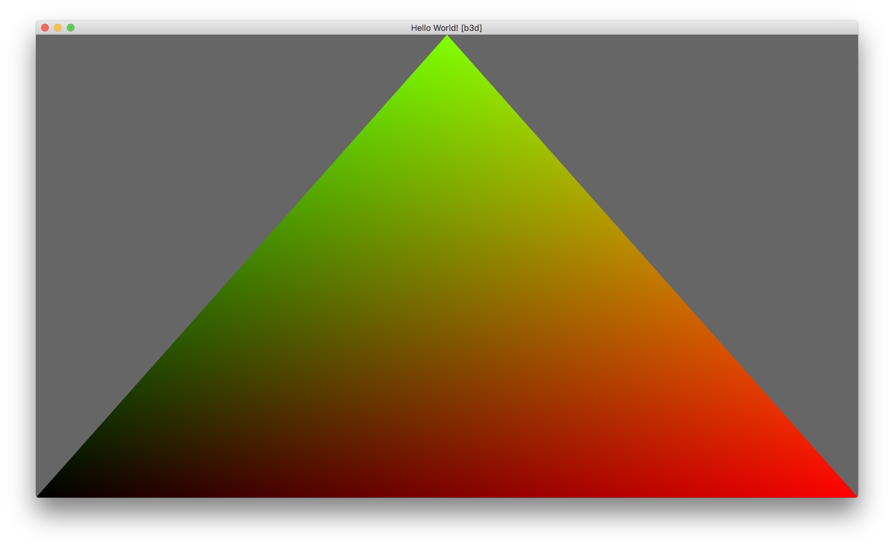

# borsch.3d



3D rendering framework written in C++, inspired by Unity3D and UnrealEngine.

## License

MIT

## Key things about borsch.3d

-   OpenGL 3.3+
-   GLSL built in to YAML container (\*.mat)
-   Unity3D-like component system
-   Tags-based render targets
-   Easy to use post-processing pipeline
-   pgm, ppm and pam as texture format, more to come...
-   dsm mesh format, more to come...
-   LUA scripting

## Screenshots










## Build and run

```
C++17 compiler support is required.
```

Build system is cmake with master makefile on top of it, following targets available:

```bash
make release    # builds b3d static lib and all examples in release mode
make debug      # builds b3d static lib and all examples in debug mode
make clean      # cleans current build
make distclean  # removes all cmake generated files
make submodules # updates and builds submodules
```

```bash
make
```

Make without argument will trigger release target.

As the result of the build process it produces static library b3d (i.e. libb3d.a) and bunch of example executables.  
When running an executable the Asset directory shall be on the same level as executable working directory.  
I.e. from shell:

```bash
./build/01_helloworld
```

### Dependencies

-   glfw: http://www.glfw.org
-   glew: http://glew.sourceforge.net
-   yaml-cpp: https://github.com/jbeder/yaml-cpp
-   GLM: https://glm.g-truc.net (_headers only_)
-   loguru: https://github.com/emilk/loguru (_headers only_)
-   lua: http://www.lua.org
-   LuaBridge: https://github.com/vinniefalco/LuaBridge (_headers only_)

GLFW and GLEW are system-wide dependencies, the rest is included as sumbodules.

### OSX / Linux

```bash
ln -s Makefile.osx Makefile
make submodules
make
```

### Windows (MSYS)

```bash
cp Makefile.msys Makefile
make submodules
make
```

## DSM mesh format

ASCII text:

```
<number of vertices>
<number of indices>
x y z nx ny nz r g b a u v
...
...
index0
index1
...
indexN
```

Example - NDC plane covering the screen:

```
4
6
-1 -1  0    0 0 1    1 1 1 1    0 0
 1 -1  0    0 0 1    1 1 1 1    1 0
 1  1  0    0 0 1    1 1 1 1    1 1
-1  1  0    0 0 1    1 1 1 1    0 1
0
1
2
0
2
3
```

## Examples

### Triangle in NDC space

#### C++

```c++
#include "b3d.h"
#include "myhelpers/all.h"

int main(int argc, char* argv[]) {
  Scene scene;

  // Step 1. Initialize application
  AppContext::Init(1280, 720, "Hello World! [b3d]", Profile("3 3 core"));
  AppContext::Instance().display.ShowCursor(false);

  // Step 2. Prepare the triangle
  std::shared_ptr<Mesh> mesh(new Mesh);
  mesh->vertices = {
    glm::vec3(-1, -1,  0),
    glm::vec3( 1, -1,  0),
    glm::vec3( 0,  1,  0)
  };

  auto triangle = scene.Add<Actor>("actor.triangle");
  triangle->AddComponent<MeshRenderer>()->SetMaterial(MaterialLoader::Load("Assets/color.mat"));
  triangle->AddComponent<MeshFilter>()->SetMesh(mesh);

  // Step 3. Define main camera.
  // We are not using any P-V-M transformations in this tutorial, so no need
  // to setup the camera position & orientation.
  // Still it is required to add at least camera.main.
  scene.Add<Camera>("camera.main");

  // Step 4. Setup RenderTarget and FrameBuffer
  Cfg<RenderTarget>(scene, "rt.screen", 2000)
    . Tags("onscreen")
    . Clear(.4, .4, .4, 1)
    . Done();

  // Step 5. Main loop. Press ESC to exit.
  do {
    AppContext::BeginFrame();
    scene.Update();
    scene.Draw();
    AppContext::EndFrame();
  } while (AppContext::Running());

  // Step 6. Cleanup and close the app.
  AppContext::Close();
  return 0;
}
```

#### Shaders

```c++
name: color.mat

pass:
  name  : color.mat/Pass
  queue : 100
  tags  : [onscreen]
  ztest : off
  cull  : ccw

  vertex: |
          #version 330 core

          layout(location = 0) in vec3 vertex_position;

          out vec3 pos;

          void main() {
            pos = vertex_position;
            gl_Position = vec4(vertex_position, 1);
          }

  fragment: |
          #version 330 core

          in vec3 pos;

          out vec4 color;
          void main () {
            vec3 p = (pos + 1) / 2;
            color = vec4(p.x, p.y, 0, 1);
          }
```



### Render to cubemap

```c++
#include "b3d.h"
#include "myactions/all.h"
#include "myhelpers/all.h"

// 1. Moves on 'Lemniscate of Gerono' trajectory in xz plane, keeps y
// 2. Updates camera position which is used for rendering to cubemap
// 3. Set shader varialbles
struct MirrorHandler: public Action {
  std::shared_ptr<Camera> camera;
  float angle = 0;
  float speed = 10; // moving speed - degrees / second in polar coordinates
  float radius = 4;
  Color surface_tint = Color(.9, .9, 1, 1);
  float surface_rr = 0.5; // 0 - reflections, 1 - refractions
  float refractive_index = 1.0/1.1; // https://en.wikipedia.org/wiki/List_of_refractive_indices

  MirrorHandler(std::shared_ptr<Transformation> transform,
                std::shared_ptr<Camera> acamera)
    : Action(transform), camera(acamera) {}

  void Update() override {
    // Lemniscate of Gerono
    angle += speed * GetTimer().GetTimeDelta();
    auto p = transform->GetLocalPosition();
    float a = glm::radians(angle);
    float x = radius*cos(a);
    float z = radius*sin(a) * cos(a);
    transform->SetLocalPosition(glm::vec3(x, p.y, z));

    // 2. Sync camera position
    camera->transform->SetLocalPosition(transform->GetLocalPosition());
  }

  void PreDraw() override {
    // 3. Uniforms
    if (auto m = transform->GetActor().GetComponent<Material>()) {
      m->SetUniform("tint", surface_tint);
      m->SetUniform("rr_factor", surface_rr);
      m->SetUniform("refractive_index", refractive_index);
    }
  }
};

int main(int argc, char* argv[]) {
  using T = std::vector<std::string>;
  using glm::vec3;
  Scene scene;

  // Step 1. Initialize application.
  AppContext::Init(1280, 720, "Render to cubemap [b3d]", Profile("3 3 core"));
  AppContext::Instance().display.ShowCursor(false);
  int width = AppContext::Instance().display.GetWidth();
  int height = AppContext::Instance().display.GetHeight();

  // Step 2. Setup onscreen and cubeenv rendertargets
  Cfg<RenderTarget>(scene, "rt.screen", 1)
    . Tags("onscreen")
    . Done();

  int w = 100, h = 100;
  auto cube_tex = Cfg<RenderTarget>(scene, "rt.cubeenv", 0)
    . Camera("camera.cubemap")
    . Tags("cubeenv")
    . Type(FrameBuffer::kCubemap)
    . Resolution(w, h)
    . Layer(Layer::kColor, Layer::kReadWrite)
    . Layer(Layer::kDepth, Layer::kWrite)
    . Done()
    ->GetLayerAsTexture(0, Layer::kColor);

  // Step 3. Compose the scene.
  Cfg<Camera>(scene, "camera.main")
    . Perspective(60, (float)width/height, .1, 500)
    . Position(7, 6, 7)
    . EulerAngles(-30, 45, 0)
    . Action<FlyingCameraController>(5)
    . Done();

  // For the cubemap camera FOV=90 and ratio 1:1.
  // The rotation is controlled by the RenderTarget where it is
  // assigned to. The position is controlled by an action.
  auto cubecam = Cfg<Camera>(scene, "camera.cubemap")
    . Perspective(90, 1, .1, 500)
    . Done();

  Cfg<Actor>(scene, "actor.skybox")
    . Model("Assets/sphere.dsm", "Assets/skybox_cubemap.mat")
    . Tags(0, T{"onscreen", "cubeenv"})
    . Done();

  Cfg<Actor>(scene, "actor.mirror")
    . Model("Assets/sphere.dsm", "Assets/cubemap_rr_surface.mat")
    . Tags(0, T{"onscreen"})  // onscreen tag comes from material, overwrite it just for consistancy
    . Texture(0, cube_tex)
    . Position(0, 1, 0)
    . Scale(2, 2, 2)
    . Action<MirrorHandler>(cubecam)
    . Done();

  auto floor = Cfg<Actor>(scene, "actor.floor")
    . Model("Assets/plane.dsm", "Assets/texture.mat")
    . Tags(0, T{"onscreen", "cubeenv"})
    . Action<Rotator>(vec3(0, 30, 0))
    . Done();

  auto k1 = Cfg<Actor>(scene, "actor.k1")
    . Model("Assets/knight.dsm", "Assets/texture.mat")
    . Tags(0, T{"onscreen", "cubeenv"})
    . Position(-4, 0, -4)
    . EulerAngles(0, 45, 0)
    . Done();

  auto k2 = Cfg<Actor>(scene, "actor.k2")
    . Model("Assets/knight.dsm", "Assets/texture.mat")
    . Tags(0, T{"onscreen", "cubeenv"})
    . Position( 4, 0, -4)
    . EulerAngles(0, -45, 0)
    . Done();

  auto k3 = Cfg<Actor>(scene, "actor.k3")
    . Model("Assets/knight.dsm", "Assets/texture.mat")
    . Tags(0, T{"onscreen", "cubeenv"})
    . Position( 4, 0,  4)
    . EulerAngles(0, -135, 0)
    . Done();

  auto k4 = Cfg<Actor>(scene, "actor.k4")
    . Model("Assets/knight.dsm", "Assets/texture.mat")
    . Tags(0, T{"onscreen", "cubeenv"})
    . Position(-4, 0,  4)
    . EulerAngles(0, 135, 0)
    . Done();

  // Set transformation relationships in order to 'stick' knights
  // to the floor and rotate then when rotate the floor.
  Transformation::SetParent(floor->transform, k1->transform);
  Transformation::SetParent(floor->transform, k2->transform);
  Transformation::SetParent(floor->transform, k3->transform);
  Transformation::SetParent(floor->transform, k4->transform);

  Cfg<Actor>(scene, "actor.fps.meter")
    . Action<FpsMeter>()
    . Done();

  // Step 4. Main loop. Press ESC to exit.
  do {
    AppContext::BeginFrame();
    scene.Update();
    scene.Draw();
    AppContext::EndFrame();
  } while (AppContext::Running());

  // Step 5. Cleanup and close the app.
  AppContext::Close();
  return 0;
}
```


## Problems and limitations

-   Some examples have visual artifacts
-   Some examples give shader error
-   "Quick and dirty" under the hood.
-   Euler ... Quaternion ... Matrices are inconsistent.
-   Unit tests (gtest)
-   Logging to stderr
-   No resource management
-   No proper error handling
-   Other to come...
